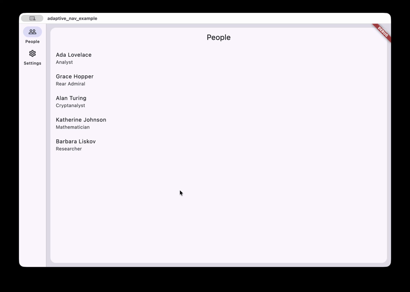
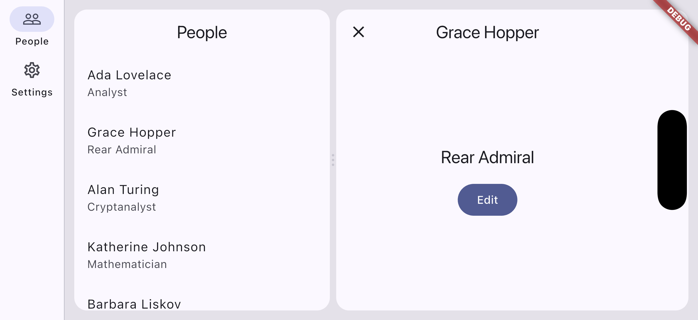
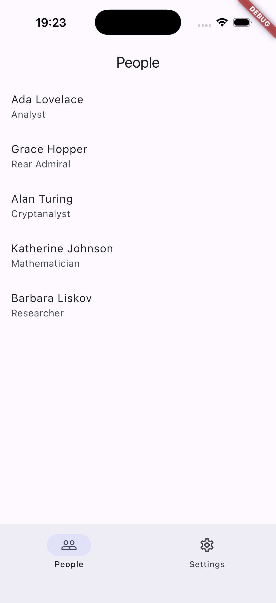
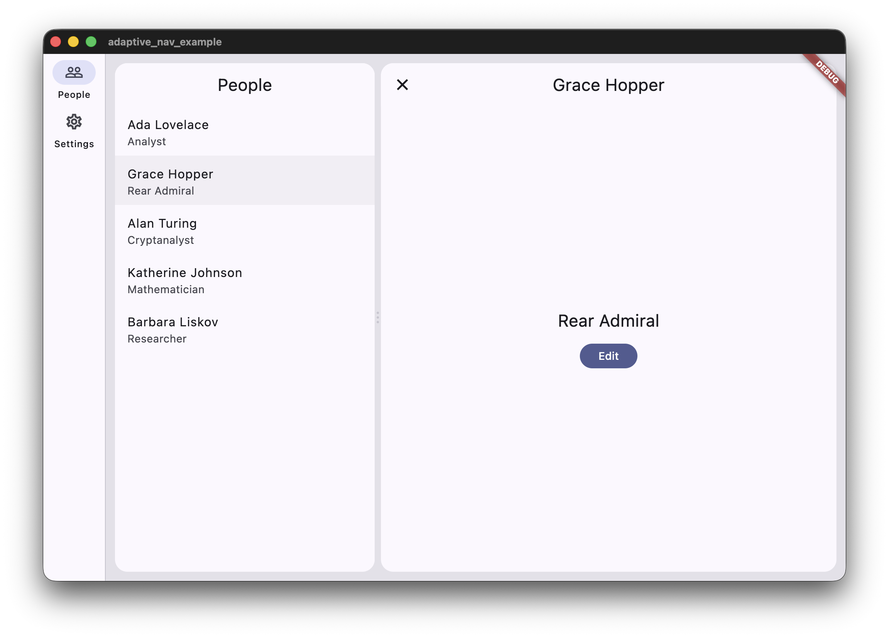

# adaptive_nav

A Navigator 2.0 router that renders **one** navigation state two ways — a stack
on a phone, master-detail panes on a tablet or desktop — and keeps screen state
across the switch.

Rotate the device, drag the window edge, unfold a foldable: the layout changes,
the screens do not. Scroll offsets, half-typed text fields, controllers and
animations all survive, because nothing is remounted — the branch `Navigator`s
move between the layouts under stable `GlobalKey`s.

The package is generic over your route type `R` and knows nothing about your
screens. You supply the branches, the `R ↔ URL` codec and the guards.



| Rotating a phone | Landscape: rail, two panes | Portrait: one stack |
| --- | --- | --- |
|  |  |  |

## Install

```yaml
dependencies:
  adaptive_nav: ^0.9.0
```

## Quick start

Define a route type and a codec, describe your branches, and hand the delegate
to `MaterialApp.router`:

```dart
sealed class AppRoute {}

class PeopleList extends AppRoute { /* ... */ }
class PersonDetail extends AppRoute {
  PersonDetail(this.id);
  final int id;
}

class AppCodec extends RouteCodec<AppRoute> {
  const AppCodec();

  @override
  Uri encode(AppRoute route) => switch (route) {
    PeopleList() => Uri.parse('/people'),
    PersonDetail(:final int id) => Uri.parse('/people/$id'),
  };

  @override
  AppRoute decode(Uri uri) { /* ... */ }

  @override
  int branchOf(AppRoute route) => 0; // which tab this route belongs to
}

final shellConfig = AdaptiveShellConfig<AppRoute>(
  branches: <BranchConfig<AppRoute>>[
    BranchConfig<AppRoute>(
      id: 'people',
      icon: Icons.people_outline,
      label: 'People',
      // Present: this branch splits into master + detail when there is room.
      masterDetail: const MasterDetailConfig(paneRatio: 0.36),
      pageBuilder: buildPage,
    ),
    BranchConfig<AppRoute>(
      id: 'settings',
      icon: Icons.settings_outlined,
      label: 'Settings',
      pageBuilder: buildPage, // no masterDetail: a plain tab
    ),
  ],
);

// The starting state: one stack per branch, each holding its root.
final initialState = NavState<AppRoute>(
  activeBranch: 0,
  branches: <BranchStack<AppRoute>>[
    BranchStack<AppRoute>(<NavEntry<AppRoute>>[
      NavEntry<AppRoute>(
        route: const PeopleList(),
        transition: AppTransition.platform,
      ),
    ]),
    BranchStack<AppRoute>(<NavEntry<AppRoute>>[
      NavEntry<AppRoute>(
        route: const SettingsRoute(),
        transition: AppTransition.platform,
      ),
    ]),
  ],
);

final delegate = AdaptiveRouterDelegate<AppRoute>(
  shellConfig: shellConfig,
  initialState: initialState,
);

MaterialApp.router(
  routerDelegate: delegate,
  routeInformationParser: AdaptiveRouteInformationParser<AppRoute>(
    codec: const AppCodec(),
    baseState: initialState,
  ),
);
```

A complete, runnable app is in [`example/`](example).

## The three layouts

Chrome and pane count are decided **separately**, which gives three states
rather than two:

| Window width | Chrome | Panes |
| --- | --- | --- |
| `< 600` (compact) | `NavigationBar` | master in the body, detail as an overlay **over the bar** |
| `600–840` (medium) | `NavigationRail` | one pane — the detail covers the master |
| `> 840` (expanded) | `NavigationRail` | two panes — master \| detail |



The chrome threshold is a width breakpoint (`AdaptiveShellConfig.showsRail`).
The pane count is decided by `MasterDetailConfig.fits` — whether the master and
the detail both fit at their minimum widths, with the decoration's margins and
gap already subtracted. A wide window with a narrow content area therefore
stays single-pane, which is the right answer.

While the detail is empty, `collapseWhenDetailEmpty` (default `true`) collapses
the split and gives the master the full width — no placeholder column next to an
empty pane. Set it to `false` and the empty detail shows
`BranchConfig.detailPlaceholder` instead. Either way both of the branch's
navigators stay mounted, so no state is lost when the split appears or goes.

## The API

Navigation is imperative and lives on the delegate:

```dart
delegate.push(route, transition: ..., onExit: ...); // returns a result future
delegate.pop();
delegate.popWithResult(value);
delegate.replace(route);
delegate.resetTo(route);        // branch becomes [route]
delegate.resetDetailTo(route);  // branch becomes [root, route]
delegate.popToRoot();
delegate.goBranch(index, resetToRoot: false);
delegate.reevaluate();          // re-run the redirect hook
```

`transition` takes an `AppTransition`: `platform`, `fade`, `modal`, `none`, or
`adaptive` (see below). Left out, it falls back to `BranchConfig.transition`.

`resetDetailTo` is the lateral move of a master-detail list: picking another
item replaces a detail of any depth — a card with an editor on top of it — in a
**single** state mutation, so the pane never flickers through an empty frame.

## Exit guards

An entry can carry an `onExit` guard, and **every** way out goes through it:
back, gesture, app bar, `replace`, `resetTo`, `popToRoot`, `resetDetailTo`, and
switching tabs.

```dart
delegate.push(
  PersonEdit(id),
  onExit: () => confirmDiscard(context), // Future<bool>
);
```

A tab switch is gated too. The screen is only parked, not destroyed, but the
user is asked about unsaved work all the same — and a refusal leaves the tab
where it was. Screens without a guard never prompt, and such a switch stays
synchronous, completing in the same frame.

## Deep links

`AdaptiveRouteInformationParser` turns an incoming URL into a `NavState` with
your `RouteCodec`, and reports the current location back for the address bar.
The round trip is defined on the visible location — the top of the active
branch. Like `go_router`, a deep link opens the target screen rather than
synthesising a multi-level back stack for it.

`AdaptiveShellConfig.redirect` is the auth guard: it can substitute the state
before it is applied. It runs on incoming URLs and on
`AdaptiveRouterDelegate.reevaluate()`, which is the equivalent of
`refreshListenable` — call it when the session changes.

## Chrome

- `barBuilder` / `railBuilder` replace the Material default completely — your
  own pill, your own icons, your own destinations. They receive **branch**
  indices, so nothing is mapped twice, and may return `null` to hide the chrome
  for a frame. A custom rail has to be exactly `AdaptiveShellConfig.railWidth`
  wide: the layout is computed from that number, and a rail that disagrees with
  it throws the detail pane width off by the difference.
- `drawerBuilder` adds a `Scaffold.drawer`, with `scaffoldKey` to open it from
  anywhere. It receives whether the layout currently uses the rail.
- `showsChrome` hides the bar and rail for a given state — an auth area with no
  tabs. Only the chrome widget goes; the branch navigators stay mounted.
- `BranchConfig.showsInChrome: false` keeps a branch navigable but gives it no
  destination (a profile or auth branch, entered programmatically).
- `extendBodyBehindBar` extends the body under a floating bar. It is off by
  default, because under the opaque default `NavigationBar` the content would
  simply disappear.
- `branchFadeDuration` turns tab switches into a Material "fade through"
  instead of an instant swap.

## Snack bars

Each pane has its own `ScaffoldMessenger`, so a message raised from a screen
appears once, in the pane the action came from, rather than twice on a phone or
stretched under both panes on a tablet. Calling
`ScaffoldMessenger.of(context)` from any screen inside a pane already lands on
the right one.

For something that belongs to no pane in particular, the delegate exposes both:

```dart
delegate.masterMessenger?.showSnackBar(const SnackBar(content: Text('Synced')));
delegate.detailMessenger?.showSnackBar(...);
```

## Panes

`PaneDecoration` makes the panes floating rounded cards on a canvas, and
`RailDecoration` does the same for the rail:

```dart
panes: PaneDecoration(
  margin: const EdgeInsets.all(12),
  gap: 8,
  radius: BorderRadius.circular(16),
  canvasColor: (context) => Theme.of(context).colorScheme.surfaceContainerHighest,
  splitHandleColor: (context) => Theme.of(context).colorScheme.outlineVariant,
),
```

The margins and the gap are **data**, not decoration painted on top: they reduce
the width left to the panes and therefore move the "one pane or two" threshold.
If your screens compute the layout with a formula of their own, they have to
subtract the same values.

Pass a `PaneSplitController` and the boundary becomes draggable, per branch,
clamped by both panes' minimum widths. The controller is owned by the app, so
the chosen width can be persisted:

```dart
final split = PaneSplitController(
  initial: loadedFractions, // if you already have them
  onCommit: (branchId, fraction) => save(branchId, fraction), // on release
);

// Or seed it later, once an async read comes back. Branches the user has
// already dragged in this session are left alone.
split.restore(await loadFractions());
```

`AdaptiveShellConfig.immersive` is a `ValueListenable<bool>` that slides the
rail out of the wide layout and hands the strip to the panes. It changes
geometry only: the layout class stays frozen, so a branch never crosses the
two-pane threshold mid-animation.

## What screens can read

Two inherited scopes let your screens adapt without recomputing the layout:

- `DetailEntryScope.isDetailRoot(context)` — this screen is the branch's first
  detail. In the wide layout it fills the pane, so its app bar should offer a
  close button (clearing the selection) rather than a back arrow.
  `Navigator.canPop()` cannot answer that: a transparent base page always sits
  underneath.
- `DetailPaneScope.of(context)` — the detail is in its own pane;
  `DetailPaneScope.isFullScreen(context)` — it is a detail shown across the
  whole area. On compact a detail covers the navigation bar, so its bottom edge
  becomes its own responsibility.

`AppTransition.adaptive` uses the same signal: a detail fades when it swaps the
contents of a pane and gets the platform slide when it takes the whole screen —
and it decides that while the animation runs, so the dismissal matches the
layout the user is actually looking at.

## Notes

**The keyboard is the focused pane's business.** Both shell `Scaffold`s run
with `resizeToAvoidBottomInset: false`, so a screen inside a pane needs its own
`Scaffold` or its own handling of `viewInsets.bottom`.

**The layout is decided at build time**, from `MediaQuery`, never inside a
`LayoutBuilder`.

**Branches are mounted lazily**, on first entry, and live from then on.

The reasoning behind these, and behind most of the design, is in
[`doc/design.md`](doc/design.md).

## Not yet

- **Fold-aware layout.** Folding and unfolding are handled, because a fold is a
  window resize and surviving one is the whole point here. What the package does
  not do is align the split to the fold — `MediaQuery.displayFeaturesOf` is not
  read. On a flat foldable that costs nothing: a crease on a continuous display
  occludes no content. It starts to matter in half-opened postures, where the
  screen is two planes at an angle and a pane straddling the crease is bent
  across both.
- **The pane arithmetic is internal.** An app that decides "wide layout or not"
  with a formula of its own has to mirror the shell's subtraction by hand; there
  is no exported helper for it yet.

## Tests

The package ships with a widget-test suite covering the invariants above:
rotation and resize preservation, the three layouts, the master-detail split and
its collapse, back handling and guards on every exit path, URL round trips, tab
state, lazy branches, pane decoration geometry, divider dragging, immersive
mode, keyboard insets and snack-bar scoping.

```sh
flutter test
```
