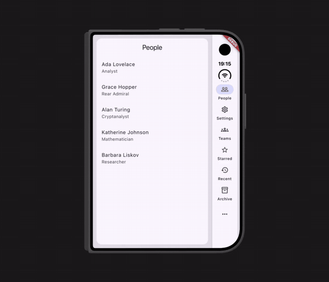
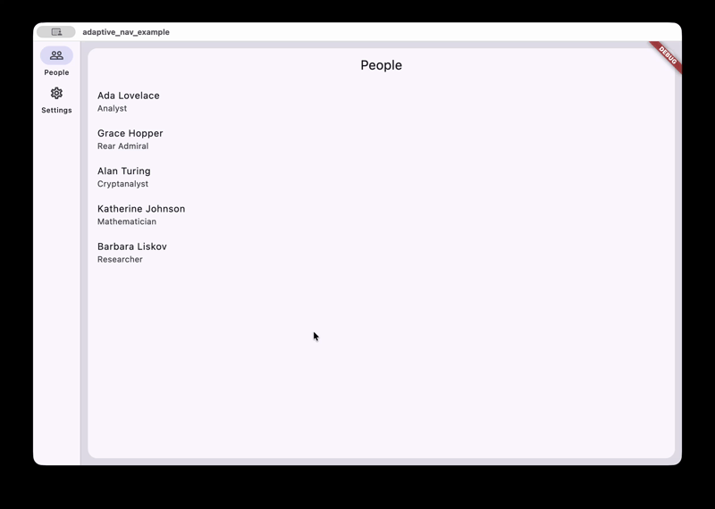
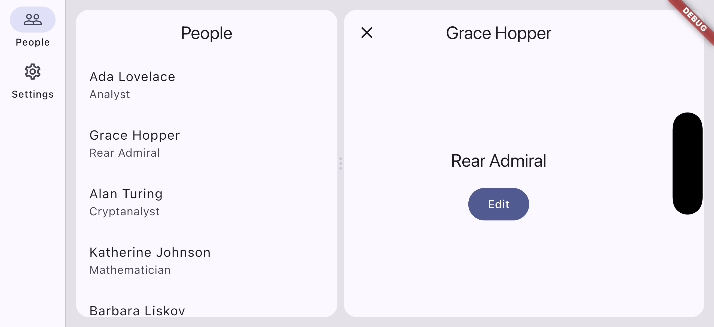
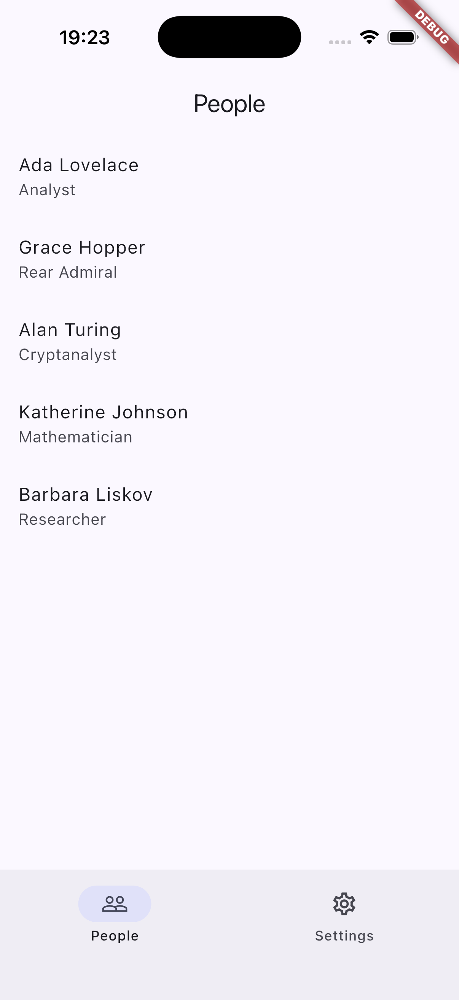
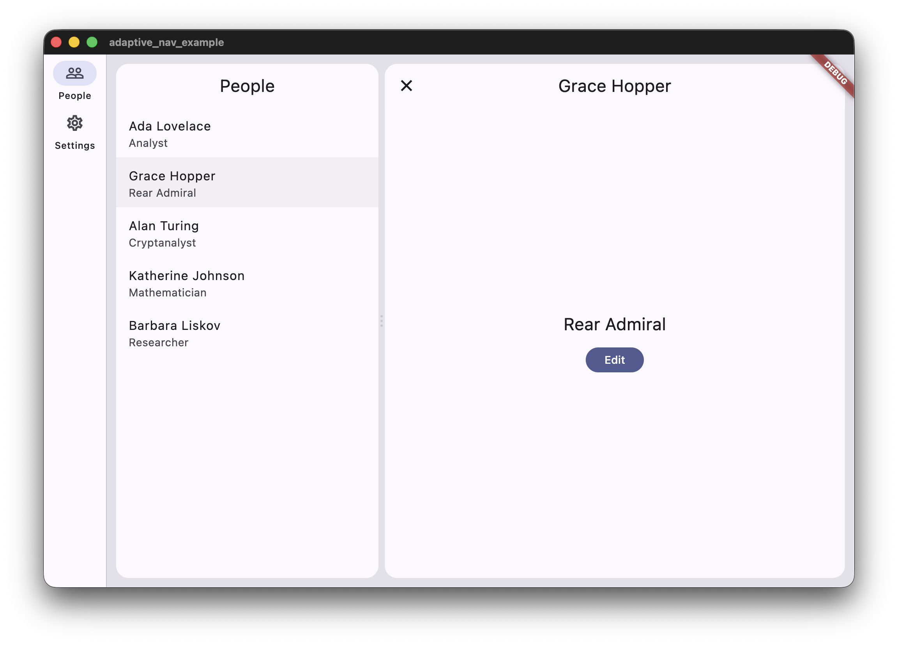

# adaptive_nav

A Navigator 2.0 router that renders **one** navigation state two ways — a stack
on a phone, master-detail panes on a tablet or desktop — and keeps screen state
across the switch.

Rotate the device, drag the window edge, unfold a foldable: the layout changes,
the screens do not. Scroll offsets, half-typed text fields, controllers and
animations all survive, because nothing is remounted — the branch `Navigator`s
move between the layouts under stable `GlobalKey`s.

The package is generic over your route type `R` and knows nothing about your
screens. You supply the branches, the `R ↔ URL` codec and the guards.

> **Ready for iPhone Duo.** On the outer display the rail moves into the
> system's own column, under the camera, and follows it as the phone turns; the
> inner display gets two panes, with a rail in landscape and a bottom bar in
> portrait. The screens keep their state through every fold. Nothing to
> configure — see [iPhone Duo](#iphone-duo).





| Rotating a phone | Landscape: rail, two panes | Portrait: one stack |
| --- | --- | --- |
|  |  |  |

## Install

```yaml
dependencies:
  adaptive_nav: ^0.10.0
```

## Quick start

Define a route type and a codec, describe your branches, and hand the delegate
to `MaterialApp.router`:

```dart
sealed class AppRoute {}

class PeopleList extends AppRoute { /* ... */ }
class PersonDetail extends AppRoute {
  PersonDetail(this.id);
  final int id;
}

class AppCodec extends RouteCodec<AppRoute> {
  const AppCodec();

  @override
  Uri encode(AppRoute route) => switch (route) {
    PeopleList() => Uri.parse('/people'),
    PersonDetail(:final int id) => Uri.parse('/people/$id'),
  };

  @override
  AppRoute decode(Uri uri) { /* ... */ }

  @override
  int branchOf(AppRoute route) => 0; // which tab this route belongs to
}

final shellConfig = AdaptiveShellConfig<AppRoute>(
  branches: <BranchConfig<AppRoute>>[
    BranchConfig<AppRoute>(
      id: 'people',
      icon: Icons.people_outline,
      label: 'People',
      // Present: this branch splits into master + detail when there is room.
      masterDetail: const MasterDetailConfig(paneRatio: 0.36),
      pageBuilder: buildPage,
    ),
    BranchConfig<AppRoute>(
      id: 'settings',
      icon: Icons.settings_outlined,
      label: 'Settings',
      pageBuilder: buildPage, // no masterDetail: a plain tab
    ),
  ],
);

// The starting state: one stack per branch, each holding its root.
final initialState = NavState<AppRoute>(
  activeBranch: 0,
  branches: <BranchStack<AppRoute>>[
    BranchStack<AppRoute>(<NavEntry<AppRoute>>[
      NavEntry<AppRoute>(
        route: const PeopleList(),
        transition: AppTransition.platform,
      ),
    ]),
    BranchStack<AppRoute>(<NavEntry<AppRoute>>[
      NavEntry<AppRoute>(
        route: const SettingsRoute(),
        transition: AppTransition.platform,
      ),
    ]),
  ],
);

final delegate = AdaptiveRouterDelegate<AppRoute>(
  shellConfig: shellConfig,
  initialState: initialState,
);

MaterialApp.router(
  routerDelegate: delegate,
  routeInformationParser: AdaptiveRouteInformationParser<AppRoute>(
    codec: const AppCodec(),
    baseState: initialState,
  ),
);
```

A complete, runnable app is in [`example/`](example).

## The layouts

Chrome and pane count are decided **separately**, so they combine rather than
step through fixed states:

| Window width | Chrome | Panes |
| --- | --- | --- |
| `< 600` (compact) | `NavigationBar` | master in the body, detail as an overlay **over the bar** |
| `600–840` (medium) | `NavigationRail` | one pane — the detail covers the master |
| `> 840` (expanded) | `NavigationRail` | two panes — master \| detail |



A bar with two panes above it is the fourth combination, and it exists for one
device: iPhone Duo's inner display in portrait is 669 points across and Apple
asks for horizontal bars there. See [iPhone Duo](#iphone-duo).

Where the chrome goes is `AdaptiveShellConfig.chromeLayout`, which returns a
`ChromePlacement` — `bottom`, `left` or `right`.
The pane count is decided by `MasterDetailConfig.fits` — whether the master and
the detail both fit at their minimum widths, with the decoration's margins, the
gap and any safe-area inset the panes only bleed under already subtracted. A
wide window with a narrow content area therefore stays single-pane, which is
the right answer.

`PaneMetrics` is that arithmetic, exported so an app that decides "is this the
wide layout" for itself arrives at the same number:

```dart
final Size window = MediaQuery.sizeOf(context);
final EdgeInsets padding = MediaQuery.paddingOf(context);
final double panes = PaneMetrics.paneAreaWidth(
  window: window.width,
  padding: padding,
  placement: shellConfig.chromeLayout(window, padding),
  railWidth: shellConfig.railWidth,
  panes: shellConfig.panes,
  rail: shellConfig.rail,
);
```

While the detail is empty, `collapseWhenDetailEmpty` (default `true`) collapses
the split and gives the master the full width — no placeholder column next to an
empty pane. Set it to `false` and the empty detail shows
`BranchConfig.detailPlaceholder` instead. Either way both of the branch's
navigators stay mounted, so no state is lost when the split appears or goes.

## The API

Navigation is imperative and lives on the delegate:

```dart
delegate.push(route, transition: ..., onExit: ...); // returns a result future
delegate.pop();
delegate.popWithResult(value);
delegate.replace(route);
delegate.resetTo(route);        // branch becomes [route]
delegate.resetDetailTo(route);  // branch becomes [root, route]
delegate.popToRoot();
delegate.goBranch(index, resetToRoot: false);
delegate.reevaluate();          // re-run the redirect hook
```

`transition` takes an `AppTransition`: `platform`, `fade`, `modal`, `none`, or
`adaptive` (see below). Left out, it falls back to `BranchConfig.transition`.

`resetDetailTo` is the lateral move of a master-detail list: picking another
item replaces a detail of any depth — a card with an editor on top of it — in a
**single** state mutation, so the pane never flickers through an empty frame.

## Exit guards

An entry can carry an `onExit` guard, and **every** way out goes through it:
back, gesture, app bar, `replace`, `resetTo`, `popToRoot`, `resetDetailTo`, and
switching tabs.

```dart
delegate.push(
  PersonEdit(id),
  onExit: () => confirmDiscard(context), // Future<bool>
);
```

A tab switch is gated too. The screen is only parked, not destroyed, but the
user is asked about unsaved work all the same — and a refusal leaves the tab
where it was. Screens without a guard never prompt, and such a switch stays
synchronous, completing in the same frame.

## Deep links

`AdaptiveRouteInformationParser` turns an incoming URL into a `NavState` with
your `RouteCodec`, and reports the current location back for the address bar.
The round trip is defined on the visible location — the top of the active
branch. Like `go_router`, a deep link opens the target screen rather than
synthesising a multi-level back stack for it.

`AdaptiveShellConfig.redirect` is the auth guard: it can substitute the state
before it is applied. It runs on incoming URLs and on
`AdaptiveRouterDelegate.reevaluate()`, which is the equivalent of
`refreshListenable` — call it when the session changes.

## Chrome

- `barBuilder` / `railBuilder` replace the Material default completely — your
  own pill, your own icons, your own destinations. They receive **branch**
  indices, so nothing is mapped twice, and may return `null` to hide the chrome
  for a frame. A custom rail has to be exactly `AdaptiveShellConfig.railWidth`
  wide: the layout is computed from that number, and a rail that disagrees with
  it throws the detail pane width off by the difference.
- `drawerBuilder` adds a `Scaffold.drawer`, with `scaffoldKey` to open it from
  anywhere. It receives whether the layout currently uses the rail.
- `showsChrome` hides the bar and rail for a given state — an auth area with no
  tabs. Only the chrome widget goes; the branch navigators stay mounted.
- `BranchConfig.showsInChrome: false` keeps a branch navigable but gives it no
  destination (a profile or auth branch, entered programmatically).
- `extendBodyBehindBar` extends the body under a floating bar. It is off by
  default, because under the opaque default `NavigationBar` the content would
  simply disappear.
- `branchFadeDuration` turns tab switches into a Material "fade through"
  instead of an instant swap.

## Snack bars

Each pane has its own `ScaffoldMessenger`, so a message raised from a screen
appears once, in the pane the action came from, rather than twice on a phone or
stretched under both panes on a tablet. Calling
`ScaffoldMessenger.of(context)` from any screen inside a pane already lands on
the right one.

For something that belongs to no pane in particular, the delegate exposes both:

```dart
delegate.masterMessenger?.showSnackBar(const SnackBar(content: Text('Synced')));
delegate.detailMessenger?.showSnackBar(...);
```

## Panes

`PaneDecoration` makes the panes floating rounded cards on a canvas, and
`RailDecoration` does the same for the rail:

```dart
panes: PaneDecoration(
  margin: const EdgeInsets.all(12),
  gap: 8,
  radius: BorderRadius.circular(16),
  canvasColor: (context) => Theme.of(context).colorScheme.surfaceContainerHighest,
  splitHandleColor: (context) => Theme.of(context).colorScheme.outlineVariant,
),
```

The margins and the gap are **data**, not decoration painted on top: they reduce
the width left to the panes and therefore move the "one pane or two" threshold.
If your screens compute the layout with a formula of their own, they have to
subtract the same values.

Pass a `PaneSplitController` and the boundary becomes draggable, per branch,
clamped by both panes' minimum widths. The controller is owned by the app, so
the chosen width can be persisted:

```dart
final split = PaneSplitController(
  initial: loadedFractions, // if you already have them
  onCommit: (branchId, fraction) => save(branchId, fraction), // on release
);

// Or seed it later, once an async read comes back. Branches the user has
// already dragged in this session are left alone.
split.restore(await loadFractions());
```

`AdaptiveShellConfig.immersive` is a `ValueListenable<bool>` that slides the
rail out of the wide layout and hands the strip to the panes. It changes
geometry only: the layout class stays frozen, so a branch never crosses the
two-pane threshold mid-animation.

## What screens can read

Two inherited scopes let your screens adapt without recomputing the layout:

- `DetailEntryScope.isDetailRoot(context)` — this screen is the branch's first
  detail. In the wide layout it fills the pane, so its app bar should offer a
  close button (clearing the selection) rather than a back arrow.
  `Navigator.canPop()` cannot answer that: a transparent base page always sits
  underneath.
- `DetailPaneScope.of(context)` — the detail is in its own pane;
  `DetailPaneScope.isFullScreen(context)` — it is a detail shown across the
  whole area. On compact a detail covers the navigation bar, so its bottom edge
  becomes its own responsibility.

`AppTransition.adaptive` uses the same signal: a detail fades when it swaps the
contents of a pane and gets the platform slide when it takes the whole screen —
and it decides that while the animation runs, so the dismissal matches the
layout the user is actually looking at.

## Notes

**The keyboard is the focused pane's business.** Both shell `Scaffold`s run
with `resizeToAvoidBottomInset: false`, so a screen inside a pane needs its own
`Scaffold` or its own handling of `viewInsets.bottom`.

**The layout is decided at build time**, from `MediaQuery`, never inside a
`LayoutBuilder`.

**Branches are mounted lazily**, on first entry, and live from then on.

The reasoning behind these, and behind most of the design, is in
[`doc/design.md`](doc/design.md).

## iPhone Duo

A fold is a window resize, so folding and unfolding cost nothing here: the
screens survive it the same way they survive a rotation. What makes iPhone Duo
different is where the system puts its own bars. The status bar is a vertical
strip 84 points wide along one edge, which edge it is changes as the device is
folded and turned, and Apple asks that an app's bars follow it —
[Designing for iPhone Duo](https://developer.apple.com/design/human-interface-guidelines/designing-for-iphone-duo).
The one exception is the inner display in portrait, which has the vertical room
for ordinary horizontal bars.

The package does that out of the box. It reads the posture straight off
`MediaQuery.padding` — a substantial inset on exactly **one** side is the system
bar — so there is nothing to configure and no platform channel. The sizes below
were measured on the iPhone Duo simulator under Xcode 27.1:

| Posture | Window | Safe area | Chrome | Pane area |
| --- | --- | --- | --- | --- |
| outer, portrait | 466 × 678 | right 84 | rail, right, under the camera | 377 |
| outer, landscape | 678 × 466 | left 84 | rail, left, under the camera | 589 |
| outer, landscape, turned the other way | 678 × 466 | right 84 | rail, right, camera below it | 589 |
| inner, portrait | 669 × 951 | top 82 | bar, bottom | 669 |
| inner, landscape | 951 × 669 | right 84 | rail, left | 786 |

### Outer display: the rail in the camera's column

The rail joins the system's column rather than taking one of its own: the camera
is at one end of that column and the controls are meant to line up with it. To
sit *with* the camera and the clock the rail needs numbers no API reports — how
far along the column the system's glyphs reach, and which vertical line they
are centred on. They are in `AdaptiveShellConfig.systemBar`, and
`SystemBarMetrics.measured` holds what the simulator shows: 150 points upright,
80 in landscape, where the system hides the clock and only the camera is left,
and an axis 48 points in from the window edge. They were read off screenshots,
so they are numbers to adjust rather than to trust; `SystemBarMetrics.none`
ignores the bar entirely.

The camera is in a corner of the glass, so turning the phone moves it along the
column: at the top upright and with the column on the left, at the bottom with
the column on the right. The reserve follows it. `SystemBarMetrics.end` takes
the window and the column's side and returns the end, should other hardware put
the camera elsewhere.

That column is short — six destinations on the outer display upright, fewer
turned, against a desktop's dozen — and Material's `NavigationRail` neither scrolls nor wraps:
past its height it simply overflows. So the shell counts them instead and puts
the rest behind a menu button at the end of the rail
(`AdaptiveShellConfig.railOverflow`, on by default). The order never changes
as you navigate; an active destination among the hidden ones leaves the rail
unselected and lights the button instead.

The count is arithmetic, not measurement — a `LayoutBuilder` around the rail
is the one thing `doc/design.md` warns against — so the shell lays the labels
out with a `TextPainter` to know how tall each destination is. A label too wide
for the rail takes a second line and that destination grows with it, alone:
"Home" is 64 points beside "People"'s 80, and the shell adds the heights up one
by one rather than counting them all at the tallest.

The button itself is `AdaptiveShellConfig.railOverflowBuilder`'s to draw — it
gets the hidden branch indices, the callback to switch to one, and whether the
active branch is among them. Which destinations it carries and the 56 points it
sits in stay with the shell, because the count above depends on both; a button
that needs more room than that is a `railBuilder` rail.

### Inner display

In landscape there is room for the rail and both panes to keep the arrangement
they have everywhere else, so the rail leads and the pane against the system
bar bleeds under it. Nothing is inset at the top there, so the rail keeps
`cornerClearance` (16 points) free rather than start in the rounded corner.

In portrait the bars are horizontal and the display is 669 points across —
enough for two panes above a bottom bar, the one layout that exists for this
device alone. The pane cards run up under the status bar and the top inset is
reserved once for the whole layout, so its 82 points cost the panes nothing but
the card's margin.

### What it means for an app

- **Nothing changes on any other device.** All of the above applies only where
  one side of the window has a vertical bar of 60 points or more and the other
  does not. A notched iPhone in landscape has large horizontal insets, but
  symmetric ones; a display cutout or Android's navigation buttons are
  one-sided but far narrower. `chrome_layout_test.dart` and
  `duo_poses_test.dart` pin every phone, tablet and desktop case to the layout
  the package always gave it.
- **The inner display in portrait needs smaller minimums.** It is the roomiest
  posture — no rail takes a share, so all 669 points go to the panes — but the
  defaults ask for 680. Pick `masterMinWidth` and `detailMinWidth` that fit,
  the way [`example/`](example) does with 300 and 330, or accept a single stack
  there. Values that fit 669 still leave the outer display a single stack,
  which is what Apple asks for.
- **Build against the iOS 27.1 SDK.** Older SDKs put the app in a compatibility
  box (375 × 667) on both displays, so none of the above applies and nothing
  can be tested.

What the package does **not** do is place your screens' own toolbar items. The
guidance there — Back and Close at the top of the vertical axis, prominent
actions next, the rest in their original groups — is for the `AppBar` inside
each pane, which is yours.

### Half open

While the device is half open the inner display is two planes at an angle, and
a pane straddling the crease is bent across both. `MasterDetailConfig.alignToFold`
(default `true`) puts the boundary on the fold instead of where `paneRatio` or a
drag would have it, and parts the panes by the width of the crease rather than
by `PaneDecoration.gap`. The divider stops being draggable while it holds — the
hinge decided — and the app's own width comes back the moment the device is
flat again, so the boundary moves once and once back.

The fold is read from `MediaQuery.displayFeatures`, and only a feature that is
vertical, active and inside the pane area counts. **The framework fills that
list on Android and not yet on iOS**, so a book-style Android foldable gets
this today while iPhone Duo does not: nothing maps Apple's `reservedRegions`
onto `displayFeatures` so far. Nothing here needs to change when it does.

Until it does, an app can say where the crease is itself:

```dart
AdaptiveShellConfig<AppRoute>(
  // A centre hinge, which is what iPhone Duo has.
  foldLocator: FoldMetrics.windowCentre,
  ...
)
```

`foldLocator` is consulted only where `displayFeatures` said nothing, so it
takes nothing away from a device that reports a real fold — and it is the app
asserting what the hardware is, not the package detecting it, which is why
there is no default.

It is also not testable by hand yet — Xcode 27.1's simulator offers open,
closed and rotate, with no half-opened posture and no hinge angle — so
`fold_split_test.dart` injects the feature directly.

## Tests

The package ships with a widget-test suite covering the invariants above:
rotation and resize preservation, the three layouts, the master-detail split and
its collapse, back handling and guards on every exit path, URL round trips, tab
state, lazy branches, pane decoration geometry, divider dragging, immersive
mode, keyboard insets and snack-bar scoping.

```sh
flutter test
```
